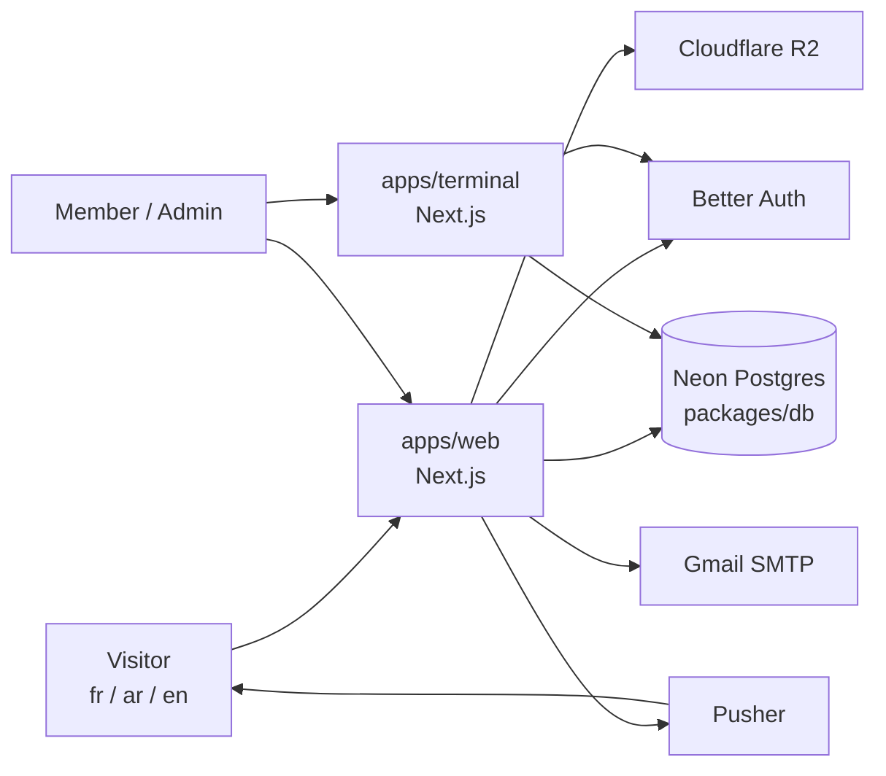
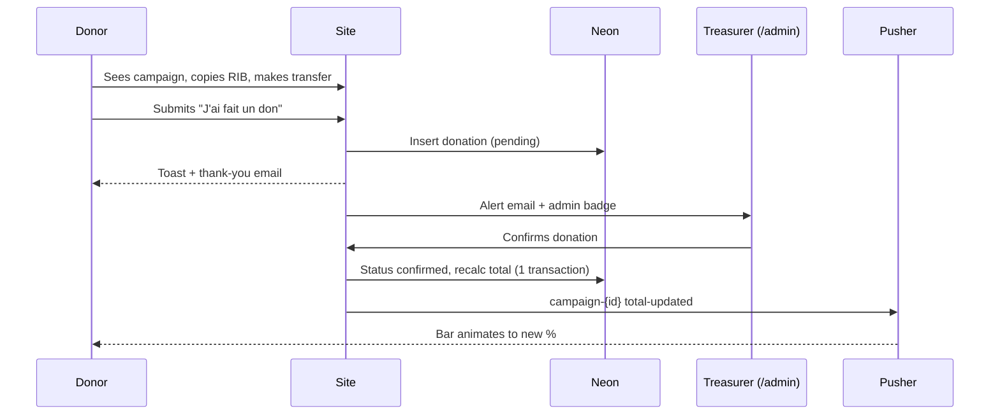

# Solident Website — Architecture & Design Spec

Sep 25, 2026 · Oussama

## 1. Solident identification

Solident is a Moroccan dental NGO founded in 2024 that brings free oral-health care and prevention to underserved communities, mainly around Larache and Ksar El Kébir. This section is the reference context for every page of the site.

### Identity

| Field | Value |
| --- | --- |
| Full name (FR) | Association Solident – Bridge de Solidarité des Médecins Dentistes |
| Full name (AR) | جمعية جسر التضامن لأطباء الأسنان |
| Short name | Solident |
| Type | Non-profit association (NGO) |
| Founded | 2024, by young dental surgeons from northern Morocco |
| Home region | Larache – Ksar El Kébir (north), actions up to Ifrane and Tamesna |
| Members | Dental students, practising dentists and non-dental volunteers |
| General email | solidentassociation@gmail.com |
| Social handles | @assoc_solident (Instagram, Facebook, TikTok); @solifun_ (Instagram) |
| Bank | Attijariwafa Bank — RIB 007 640 0006029000304812 15 |

### Mission, vision, values

- **Mission:** promote oral health through awareness and prevention campaigns and dental caravans for people in need, with equitable access to care and hygiene education.
- **Vision:** make oral health a priority in every citizen's life, and give new scale to the culture of volunteering.
- **Values:** solidarity, kindness (bienveillance), collective action, volunteering.
- **Team charter (AG, 20 Sept 2026):** more flexibility, a shared load, sincere commitments, simple communication. Motto: "Chacun fait ce qu'il peut. Chacun dit clairement ce qu'il peut faire."

### Governance

- The General Assembly meets at least once a year; all active members vote, decisions by majority of those present.
- An extraordinary AG can be called by the president, 3 board members, or a majority of active members.
- Membership is lost by written resignation, exclusion for serious fault, or one month of unjustified inactivity.
- Since the last AG, each next step is piloted by a small binôme (pair of members).

### Executive board

| Name | Role |
| --- | --- |
| Raihan El Achrafi | Présidente |
| Nouhaila Ben Moussa | Vice-présidente, ressources humaines |
| Taha Boukour | Vice-président, relations externes |
| Hadil Chebli | Secrétaire générale |
| Mohamed Dobli Bennani | Vice-secrétaire général |
| Nouha Bakkali Maassom | Trésorière |
| Hidaya Jitane | Vice-trésorière |
| Yasser Marouan | Responsable médiatisation |
| Iqbal Hammati | Responsable projets et événements |
| Badreddine Ouali | Responsable relations externes |
| Hiba Akhazzan | Conseillère |

Public contacts (sponsoring dossier): Raihan El Achrafi +212 653-956056; Badreddine Ouali +212 612-299150; Nouha Bakkali Maassom +212 681-922477.

### Programmes (2026–2027 annual plan)

| Programme | What it is | Status |
| --- | --- | --- |
| Caravane Jissr Attadamon | Flagship medical + humanitarian caravan, Douar Oulad Ouchih (Ksar El Kébir), 27–29 Nov 2026, ~400 families | Main project, budget 156,563 DH |
| Volet scientifique | Scientific days for students and practitioners; revenue funds solidarity actions | Main project, several days planned |
| Solifun | "Play hard, give harder" — padel, vélo, kayak, foot, FIFA, trips that raise funds | Main project, event by event |
| Jeunes ambassadeurs | Oral-hygiene prevention days in schools, brushing kits | Main project, fewer but better-targeted days |
| Basmat Al Amal | Full dental care + dentures in retirement homes | 3rd edition postponed |
| Actions complémentaires | Collaborations, orphanage and retirement-home visits | Ongoing |

Jissr Attadamon budget breakdown: caravane médicale 80,213 DH · caravane humanitaire 61,350 DH (mosque renovation 50,900 DH + food baskets 10,450 DH for 50 families at 209 DH each) · transport 15,000 DH.

### Dental caravans delivered (14)

| Date | Location | Partner |
| --- | --- | --- |
| 18 Apr 2026 | Tamesna | Racines marocaines sans frontières |
| 20–21 Dec 2025 | Bouqachmir | Caravane Al Amal |
| 16 Aug 2025 | Bni Leit | ECDH |
| 12–13 Jul 2025 | Région d'Ifrane | Les racines d'espoir |
| 28–29 Jun 2025 | Souk Tolba | Skout Ksar |
| 25–27 Apr 2025 | Al Mussaly | Enimbenevolat |
| 14 Feb 2025 | Aït Oumdiss | CASINPT |
| 25–26 Jan 2025 | Oulad Hmid | Skout Ksar |
| 7–8 Dec 2024 | Assoul | Caravane Al Amal |
| 16–17 Nov 2024 | Boujadian | Skout Ksar |
| 5 Oct 2024 | Ksar El Kébir | Hand in Hand AUI |
| 28 Sep 2024 | Aït Ouadfal | CASINPT |
| 25 Sep 2024 | Had Lgharbia | Fondation Safir |
| 17 Aug 2024 | Bni Harchen | ECDH |

Each caravan offered consultations, scaling, extractions, prevention sessions, and dental kits and medicines. Instagram highlights already show a "15.0" edition, not yet in the dossier.

### Other actions delivered

| Date | Action | Result |
| --- | --- | --- |
| Dec 2025 – Mar 2026 | Jeunes ambassadeurs | 8 school prevention days (Laithe, La Renaissance, Riad Alandalus, Les Capucines, Chams Al Maarifa, Jil Tadamone, Les 4 Temps, High Tech Az-Zahraa) |
| Nov 2025 – Apr 2026 | Basmat Al Amal 2.0, Ain El Aouda retirement home | 9 action days; 16 of 31 residents fully treated with dentures; 21 of 31 got eye exams and glasses |
| 4 Apr 2026 | Scientific day: Imagerie dentaire au cœur du diagnostic moderne | Delivered |
| 8 Feb 2026 | Scientific day: Dentistry Unfiltered | Delivered |
| Sep 2024 – Apr 2026 | Basmat Al Amal 1.0, Larache retirement home (with Association Caritative Islamique) | 6 weekends; 16 of 32 residents fully treated with dentures |
| 6 Apr 2024 | Bsaha Ftourhom (with ECDH) | 100 iftar meals, Larache |
| 5 Apr 2024 | Orphanage visit, Larache | Dental consultations, prevention, Eid gifts |

### Partners and funding

- **Past partners (19):** MC Pharma, Colgate, Fondation Orient-Occident, Caravane Al Amal, Scoutisme Hassania Marocain (Ksar El Kébir), Club Sahara Padel, MJ Bike, Hôtel des Thermes, Espoir Sportif Nautique, Le Déclic, Al Akhawayn University, Fondation Safir, Club Affaires Sociales INPT, Groupe Scolaire Les Quatre Temps, High-Tech Groupe Scolaire, Silent Believers Distribution, Association Caritative Islamique, and others.
- **Funding sources:** sponsorship packages, bank transfers to the RIB, Solifun events, scientific-day revenue.
- **Sponsorship packages:** Diamond from 30,000 DH · Gold from 20,000 DH · Silver from 10,000 DH · Bronze from 3,000 DH. Benefits: all tiers get thank-you posts and logo on social media; Silver+ adds logo on caravan supports (banner, roll-up, badges); Gold+ adds a "Best Of" caravan video; Diamond adds branded goodies and distribution of the sponsor's flyers.

### Brand

- Logo: a stylised "S" holding a tooth, ringed by a yellow brush stroke with "Association Solident".
- Colours: navy blue (about #1E5470) and golden yellow (about #F4B223), on white or warm cream.
- Tone: warm, engaged, youthful; content in French and Arabic today, with Darija for awareness posts.
- Audience today: 2,734 Instagram followers (@assoc_solident), 229 for @solifun_ (Sept 2026).

## 2. Goals and audiences

The site is Solident's public face: it turns Instagram-scattered information into one trilingual place to learn, donate, sponsor, sign up and join. Internal work stays in Solident Terminal.

| Audience | What they need | Primary action |
| --- | --- | --- |
| Sponsors and companies | Credibility, impact figures, packages, dossier | Download dossier, contact external relations |
| Individual donors (Morocco and diaspora) | Trust, current campaign, how to give | Transfer to the RIB, declare the donation |
| Dental students and practitioners | Scientific days, volunteering on caravans | Register for an event, apply as volunteer |
| General public and Solifun participants | Upcoming fun events | Register for a Solifun event |
| Partner associations and schools | Past collaborations, contact | Contact form |
| Members | Quick access to internal tools | Log in to /admin or Terminal |

**Success measures (first 6 months):** Jissr Attadamon progress bar live before 27 Nov 2026; all Solifun sign-ups moved off Google Forms; every past action documented with photos in 3 languages.

## 3. Tech stack and architecture

The website and Solident Terminal share one Neon database and one login system, organised as a pnpm monorepo with two Next.js apps and a shared database package. Supabase is retired once Terminal is migrated.

| Layer | Choice | Role |
| --- | --- | --- |
| Framework | Next.js (App Router, TypeScript) | Public site `apps/web`, internal ERP `apps/terminal` |
| Languages | next-intl | `/fr`, `/ar`, `/en`; Arabic renders `dir="rtl"`; default locale `fr` |
| Database | Neon Postgres + Prisma ORM (`@prisma/adapter-neon`) | One schema.prisma in `packages/db`, used by both apps; Neon branch per preview deploy |
| Auth | Better Auth (Prisma adapter, magic-link plugin) | Invite-only email magic link via existing Nodemailer + Gmail; database sessions (30 days); roles stored on `users` |
| Authorisation | Server-side guards (`requireRole`) | Replaces Supabase RLS: every server action checks role before touching data |
| Realtime | Pusher Channels | Live progress bar and registration counters; admin alerts |
| Media | Cloudflare R2 | Photos, logos, dossier PDF, donation proofs (private) |
| Email | Nodemailer + Gmail SMTP | Confirmations and team alerts |
| Hosting | Vercel Hobby, `*.vercel.app` | Two projects: web and terminal |
| Scheduled jobs | cron-job.org (as today) | Digests, reminders |

Both apps read and write the same tables, so an event created in Terminal appears on the public site without re-entry.

### Coding conventions

- Every server action returns `{ status: 'success', data }` or throws an `Error` the UI catches; never `null`.
- Every client call shows a loading state (disabled button + spinner) and a success or error toast.
- Inputs are validated with Zod on the server before any write; multi-step writes (e.g. confirming a donation and recalculating totals) run in one database transaction (`prisma.$transaction`).
- Translatable text lives in JSON message files; database content uses `_fr`, `_ar`, `_en` columns.

### Known limits to watch

- **R2 public URLs:** without a custom domain, public files are served from an `r2.dev` address, which Cloudflare rate-limits and does not intend for production. Fine to start; move to a custom domain later.
- **Vercel Hobby:** image-optimisation and function quotas are limited; compress photos on upload.
- **No RLS:** security depends on the server guards, so every admin route and action needs a role check.
- **Prisma on Vercel:** use Neon's pooled connection string through `@prisma/adapter-neon` for the app, a direct (unpooled) URL for `prisma migrate`, and run `prisma generate` during the build so both apps get a fresh client.

## 4. Site map and pages

The public site has 9 top-level sections, each available in French, Arabic and English, with Solifun as a section inside Solident.

| Route | Page | Content | Data source |
| --- | --- | --- | --- |
| `/[locale]` | Accueil | Hero + mission, impact counters, live Jissr Attadamon progress bar, next 3 events, partner logo strip, CTAs Donate / Sponsor / Volunteer | `campaigns`, `events`, `impact_stats`, `partners` |
| `/qui-sommes-nous` | About | Story since 2024, mission, vision, values, team charter, governance summary, board grid | `team_members`, static text |
| `/programmes` | Programmes index | 5 programme cards | `programmes` |
| `/programmes/[slug]` | Programme detail | Description, goals, photos, related actions and events | `programmes`, `actions`, `events` |
| `/actions` | Actions & impact | Map of Morocco with a pin per caravan, filterable timeline, totals | `actions` |
| `/actions/[slug]` | Action detail | Date, place, partner, figures, gallery | `actions`, `media` |
| `/evenements` | Events | Upcoming and past, filter by type | `events` |
| `/evenements/[slug]` | Event detail | Info, places left (live), registration form | `events`, `registrations` |
| `/solifun` | Solifun hub | Slogan, how funds are used, activity cards (padel, vélo, kayak, foot, FIFA, voyage), Solifun events, gallery | `events` where type = solifun |
| `/soutenir/don` | Donate | Active campaigns with progress bars, RIB + copy button + QR code, "J'ai fait un don" form | `campaigns`, `donations` |
| `/soutenir/sponsoring` | Sponsor | Why support us, Diamond/Gold/Silver/Bronze table, dossier download, sponsor inquiry form | `sponsor_tiers`, `inquiries` |
| `/soutenir/benevolat` | Volunteer | Profiles sought, application form | `volunteer_applications` |
| `/partenaires` | Partners | Logo wall grouped by type, link to actions done together | `partners` |
| `/contact` | Contact | Form, email, board contacts, social links | `inquiries` |
| `/admin` | Back-office | See section 7 | all tables |

Slugs stay in French for all languages (e.g. `/ar/actions/tamesna-2026`); page titles and content are translated.

## 5. Data model (Neon)

The website adds 12 tables to the shared schema; `users` and `events` are shared with Terminal, and Terminal's existing tables (tasks, projects, cellules, proposals, notifications, settings) move over unchanged in Phase 4.

| Table | Key columns | Used by |
| --- | --- | --- |
| `users` | id, name, email, image, role (`admin` / `treasurer` / `hr` / `media` / `member`), is_active (+ Better Auth `accounts`, `sessions`, `verifications`) | Better Auth, both apps |
| `programmes` | id, slug, title_fr/ar/en, summary_*, body_*, cover_url, order, is_active | Site |
| `actions` | id, slug, programme_id, title_*, date_start, date_end, location, lat, lng, partner_ids[], beneficiaries_count, body_*, is_published | Site, Terminal |
| `events` | id, slug, type (`caravane` / `scientifique` / `solifun` / `ambassadeurs` / `autre`), title_*, body_*, starts_at, ends_at, location, capacity, registration_open, cover_url, is_published | Site, Terminal |
| `registrations` | id, event_id, full_name, phone, email, city, profile (`etudiant` / `praticien` / `public`), note, status (`new` / `processed` / `cancelled`), created_at | Site form, HR in admin |
| `campaigns` | id, slug, title_*, goal_dh, starts_on, ends_on, cover_url, is_active, action_id | Donate page, progress bar |
| `donations` | id, campaign_id, donor_name, email, phone, amount_dh, is_anonymous, proof_key (private R2), status (`pending` / `confirmed` / `rejected`), confirmed_by, confirmed_at, source (`form` / `manual`) | Donate form, treasurer |
| `sponsor_tiers` | id, name, min_dh, benefits_* (json), order | Sponsoring page |
| `partners` | id, name, logo_url, type (`sponsor` / `association` / `ecole` / `universite` / `sport`), website, is_visible | Site |
| `team_members` | id, full_name, role_*, photo_url, order, is_board | About page |
| `volunteer_applications` | id, full_name, email, phone, city, profile, skills, availability, motivation, status (`new` / `contacted` / `accepted` / `declined`) | Volunteer form, HR |
| `inquiries` | id, kind (`contact` / `sponsor`), full_name, organisation, email, phone, message, tier_id, status | Contact + sponsor forms |
| `media` | id, owner_type, owner_id, r2_key, url, alt_*, width, height, order | Galleries |
| `impact_stats` | key, value, label_* (cached counters, recalculated on change) | Homepage |
| `audit_log` | id, user_id, action, entity, entity_id, payload (json), created_at | Admin actions |

Campaign total = `SUM(amount_dh)` of `donations` where status = `confirmed`, recalculated inside the confirm transaction.

### Form field to column mapping

| Form | Input id | Column | Rule |
| --- | --- | --- | --- |
| Event registration | `reg-name` | registrations.full_name | required, 2–80 chars |
| Event registration | `reg-phone` | registrations.phone | required, Moroccan or intl format |
| Event registration | `reg-email` | registrations.email | optional, valid email |
| Event registration | `reg-city` | registrations.city | optional |
| Event registration | `reg-profile` | registrations.profile | select |
| Event registration | `reg-note` | registrations.note | optional, ≤ 500 chars |
| Donation declaration | `don-name` | donations.donor_name | required unless anonymous |
| Donation declaration | `don-anon` | donations.is_anonymous | checkbox |
| Donation declaration | `don-amount` | donations.amount_dh | required, integer ≥ 10 |
| Donation declaration | `don-email` | donations.email | optional, for thank-you email |
| Donation declaration | `don-proof` | donations.proof_key | optional image/PDF ≤ 5 MB |
| Volunteer | `vol-name`, `vol-email`, `vol-phone`, `vol-city` | volunteer_applications.* | name + phone required |
| Volunteer | `vol-profile`, `vol-skills`, `vol-availability`, `vol-motivation` | volunteer_applications.* | select / text |
| Sponsor inquiry | `sp-org`, `sp-name`, `sp-email`, `sp-phone`, `sp-tier`, `sp-message` | inquiries.* (kind = sponsor) | org + email required |

## 6. Key flows

Three public flows carry the site: donation with a live progress bar, event registration, and volunteer application. All follow the same pattern: form → server action → Neon → feedback + email.

### Donation and progress bar

- Transfers the treasurer sees on the bank statement without a declaration are added in `/admin` as `source = manual`.
- The bar shows raised DH, goal DH, % and number of donors; anonymous donors count but are never named.
- Donation proofs sit in a private R2 bucket, viewable only by `admin` and `treasurer` through short-lived signed links.

### Event registration (Solifun and others)

1. Visitor opens an event with `registration_open = true`.
2. Submits the form; the server checks capacity and duplicate phone in one transaction.
3. Row saved with status `new`; places-left counter updates live via Pusher channel `event-{id}`.
4. Visitor gets a success toast (and email if given); HR sees the new row in `/admin/inscriptions` and processes it later.
5. When capacity is reached the form closes automatically and shows "Complet".

### Volunteer application

1. Visitor fills the volunteer form on `/soutenir/benevolat`.
2. Row saved with status `new`; HR is emailed.
3. HR moves it to `contacted`, `accepted` or `declined`; accepted people can then be invited as Terminal members.

## 7. /admin back-office

`/admin` lives in the website app, uses the same Better Auth login as Terminal, and gives each role only the screens it needs.

| Screen | Route | admin | treasurer | hr | media |
| --- | --- | --- | --- | --- | --- |
| Dashboard (counters, alerts) | `/admin` | Yes | Yes | Yes | Yes |
| Campaigns | `/admin/campagnes` | Yes | Yes | — | — |
| Donations (confirm, reject, add manual) | `/admin/dons` | Yes | Yes | — | — |
| Events | `/admin/evenements` | Yes | — | — | Yes |
| Registrations (process, export CSV) | `/admin/inscriptions` | Yes | — | Yes | — |
| Volunteer applications | `/admin/benevoles` | Yes | — | Yes | — |
| Inquiries (contact, sponsors) | `/admin/messages` | Yes | — | — | — |
| Actions, programmes, galleries | `/admin/contenu` | Yes | — | — | Yes |
| Partners, team | `/admin/partenaires`, `/admin/equipe` | Yes | — | — | Yes |
| Users and roles | `/admin/utilisateurs` | Yes | — | — | — |

- Suggested first holders: treasurer = Trésorière, hr = VP ressources humaines, media = Responsable médiatisation, admin = Oussama.
- Every content form has three language tabs (FR / AR / EN); a record can be published once French is filled, with missing languages falling back to French.
- Photo uploads go straight from the browser to R2 via signed URLs, then are compressed to a web size.
- Every confirm, reject or delete is logged (who, when, what) in `audit_log`.

## 8. Design system

The look extends the sponsoring dossier's navy-and-gold identity into a warm, modern web style: cream backgrounds, bold geometric headings, rounded cards and a glass navigation bar.

### Colour tokens

| Token | Hex | Use |
| --- | --- | --- |
| `--navy-900` | #123A4F | Footer, dark sections, body text on cream |
| `--navy-700` | #1E5470 | Primary brand, headings, primary buttons |
| `--navy-100` | #E3EDF2 | Tinted panels, table headers |
| `--gold-500` | #F4B223 | Accent, CTAs (Donate), progress bar fill, highlights |
| `--gold-100` | #FDF1D3 | Soft highlight backgrounds, badges |
| `--cream-50` | #FBF8F2 | Page background |
| `--ink-600` | #4A5A66 | Secondary text |
| `--success` | #2E8B6A | Success toasts, confirmed status |
| `--danger` | #C8553D | Error toasts, rejected status |
| `--solifun-sky` | #2FA4D8 | Solifun section accent only |

Dark mode for `/admin` only, swapping cream for `--navy-900` surfaces; the public site stays light.

### Typography

- Headings (Latin): Poppins 700/600 — matches the dossier.
- Body (Latin): Montserrat 400/500, 16–18 px, line height 1.6.
- Arabic: IBM Plex Sans Arabic (headings 700, body 400); loaded only on `/ar`.
- Accent script for labels such as "Caravanes dentaires": a handwritten font used sparingly, as in the dossier.

### Components and feel

- Cards: 12 px radius, soft shadow `0 8px 24px rgba(18,58,79,.08)`, lift 4 px on hover.
- Buttons: 10 px radius; primary navy, CTA gold with navy text; hover darkens 8 %, active scales to 0.97, disabled shows spinner.
- Navigation: sticky glassmorphism bar (`backdrop-filter: blur(12px)`, 70 % cream), language switcher FR / ع / EN.
- Progress bar: 14 px tall, rounded, gold fill animating on update, raised / goal / % / donors below.
- Impact counters: numbers count up when scrolled into view.
- Action map: Morocco outline with gold pins; clicking a pin opens a card with photo, date and partner.
- Toasts: bottom-right (bottom-left in RTL), auto-dismiss after 4 s, success / error / info colours.
- Section dividers reuse the dossier's navy line + gold dot motif.

### Solifun sub-brand

- Same layout and fonts; accent switches to `--solifun-sky` + gold, with diagonal energetic shapes and full-bleed action photos.
- Slogan "Play hard, give harder" as the hero, plus a "where the money goes" strip linking to the funded campaign.

### RTL and accessibility

- Layout built with logical CSS properties (`margin-inline-start`, etc.) so Arabic mirrors automatically; icons with direction (arrows) flip.
- Text contrast at least 4.5:1 (gold is never used for small text on white).
- Every image has alt text in all three languages; beneficiary faces, especially children, are blurred before upload.

## 9. Roadmap

The donation page and progress bar go live by 25 Oct 2026, giving about a month of fundraising before the Jissr Attadamon caravan on 27 Nov 2026; Terminal migrates after the caravan.

| Phase | Dates | Scope | Done when |
| --- | --- | --- | --- |
| 0. Foundations | 28 Sep – 4 Oct 2026 | Monorepo, Neon project + branches, Prisma schema + first migration, Better Auth magic link, R2 buckets, Pusher app, next-intl with FR/AR/EN, design tokens | Login works; empty pages render in 3 languages incl. RTL |
| 1. Fundraising launch | 5 – 25 Oct 2026 | Accueil, Qui sommes-nous, Soutenir (don + sponsoring), Contact, Jissr Attadamon campaign, `/admin` campaigns + donations + users | First confirmed donation moves the bar live |
| 2. Events and content | 26 Oct – 15 Nov 2026 | Événements + registrations, Solifun hub, bénévolat, Programmes, Actions map with the 14 caravans, Partenaires, `/admin` HR + media screens | Solifun sign-ups off Google Forms; all past actions published |
| 3. Caravan period | 16 Nov – 5 Dec 2026 | Freeze features; live bar, daily content updates, post-caravan report page | Caravan report online |
| 4. Terminal migration | Dec 2026 – Jan 2027 | Move Terminal data Supabase → Neon, profiles → `users`, storage → R2, RLS → server guards, email digests re-pointed, cutover weekend | Terminal runs on Neon; Supabase project archived |
| 5. Later | 2027 | Custom domain (then R2 custom domain + Cloudflare DNS), newsletter, annual report pages | — |

### Terminal migration checklist

- [ ] Export every Supabase table and map it to the Prisma schema
- [ ] Rebuild each RLS policy as a `requireRole` check and list them side by side
- [ ] Copy the `covers` and avatar buckets to R2 and rewrite stored URLs
- [ ] Move members to Better Auth users with the same email so nobody re-registers
- [ ] Re-point the cron-job.org digest to the new route
- [ ] Dry-run on a Neon branch, then cut over on a quiet weekend

## 10. Decisions and open questions

| Decided | Choice |
| --- | --- |
| Stack | Next.js + Neon + Prisma + Better Auth + Pusher + Cloudflare R2 on Vercel |
| Repo | Existing `solident_terminal` repo restructured into a pnpm monorepo (`apps/terminal`, `apps/web`, `packages/db`) |
| Pusher | Included from day one |
| Database | One Neon database shared by the site and Terminal |
| Terminal | Migrates from Supabase to Neon (after the caravan) |
| Languages | Arabic, French, English |
| Donations | RIB displayed + progress bar per campaign |
| Solifun | Section inside the Solident site |
| Admin | `/admin` with roles |
| Registrations | Collect names only; HR processes later |
| Email | Same Gmail SMTP account Terminal uses |
| Domain and media | Free `vercel.app` domain for now; photos and board contacts public, beneficiary faces blurred |

### Open questions

- [ ] Default language when a visitor arrives: French or Arabic?
- [ ] Registration form: is phone required, and which extra fields (e.g. padel level, bike ownership) per activity?
- [ ] Show a public donor wall (names of non-anonymous donors) or only totals?
- [ ] Who writes and checks the Arabic and English translations?
- [ ] Preferred Vercel subdomain, e.g. `solident.vercel.app`?
